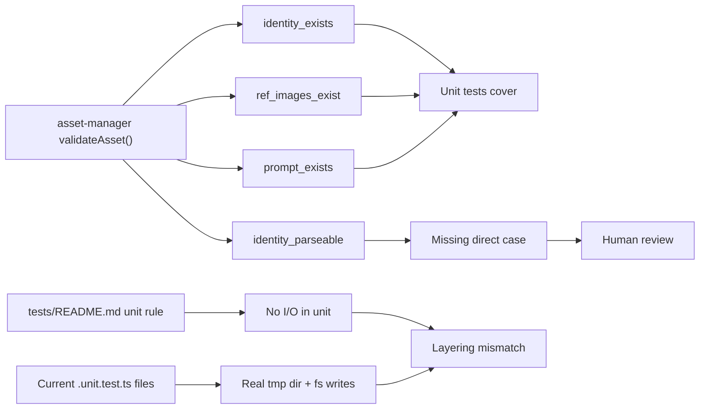

# Prompt Engine & Asset Manager Test Review

> [!abstract] AI Verdict
> **Overall verdict:** `PASS WITH GAPS`
> **Primary concern:** 关键 happy path 已覆盖，但 ==测试分层不准== 且有一条明确校验链未直接覆盖。
> **Human review load:** `2` items should be reviewed first.
> **Confidence:** `Medium`

> [!danger] Human First
> 只在这里放 ==真正需要人工先看== 的问题。
>
> 1. `[P2]` unit test 分层与仓库约定不一致
>    为什么需要人看：这会让后续 test gate 的含义失真，影响你对 “unit 稳定、纯逻辑” 的判断。
> 2. `[P2]` `validateAsset()` 的 `identity_parseable=false` 未直接覆盖
>    为什么需要人看：实现里有明确失败路径，但目前只能靠代码阅读推断，而不是靠测试证明。

> [!warning] AI Flagged Gaps
> - `prompt-render` 的 warning 路径没有直接覆盖
> - `prompt-render` 的 render JSON payload 覆盖偏薄
> - `asset-manager` CLI 文本模式未覆盖
> - 非法参数矩阵覆盖偏薄

> [!tip] Covered Well
> - `prompt-engine` 的替换、变量发现、模板加载、资产 prompt 片段回退都已有直接断言
> - `asset-manager` 的列表、详情、校验主流程都有 happy path
> - CLI contract integration tests 已补上关键工作流衔接

## Scope

- Feature: P4 Prompt 模板引擎 + P5 资产管理增强
- Scope boundary: 主清单以 `TASK No.6` unit tests 为主，`TASK No.7` integration/contract tests 作为旁注
- Focus: 覆盖面、测试分层、断言强度、CLI 契约完整性
- Source modules:
  - [prompt-engine.ts](/Users/wildmaker/Documents/Projects/auto-video/packages/video-tools/src/utils/prompt-engine.ts)
  - [asset-manager.ts](/Users/wildmaker/Documents/Projects/auto-video/packages/video-tools/src/utils/asset-manager.ts)
  - [prompt-render.ts](/Users/wildmaker/Documents/Projects/auto-video/packages/video-tools/src/commands/prompt-render.ts)
  - [asset-manager.ts](/Users/wildmaker/Documents/Projects/auto-video/packages/video-tools/src/commands/asset-manager.ts)
- Test files:
  - [prompt-engine.unit.test.ts](/Users/wildmaker/Documents/Projects/auto-video/tools/tests/unit/prompt-engine.unit.test.ts)
  - [asset-manager.unit.test.ts](/Users/wildmaker/Documents/Projects/auto-video/tools/tests/unit/asset-manager.unit.test.ts)
- Strong related non-unit tests:
  - [prompt-render.cli.integration.test.ts](/Users/wildmaker/Documents/Projects/auto-video/tools/tests/integration/prompt-render.cli.integration.test.ts)
  - [asset-manager.cli.integration.test.ts](/Users/wildmaker/Documents/Projects/auto-video/tools/tests/integration/asset-manager.cli.integration.test.ts)
  - [prompt-asset-contract.integration.test.ts](/Users/wildmaker/Documents/Projects/auto-video/tools/tests/integration/prompt-asset-contract.integration.test.ts)

## Human Review Checklist

- [ ] 判断真实文件系统依赖是否应该从 `.unit.test.ts` 挪到 integration 层
- [ ] 判断 `identity_parseable=false` 是否必须补成明确 test case
- [ ] 判断 CLI 文本模式与 warning 输出是否属于当前任务必须补齐范围
- [ ] 确认当前 happy path 重复是否属于可接受的分层重复

## Coverage Heatmap

| Area | Layer | Coverage | Confidence | Human action |
|---|---|---|---|---|
| Prompt 模板引擎 / 文本渲染 | `unit` | `Strong` | `High` | 无需优先处理 |
| Prompt 模板引擎 / CLI 契约 | `integration` | `Adequate` | `Medium` | 确认 warning / JSON render 是否需要补 |
| 资产管理 / 校验链 | `unit` | `Adequate` | `Medium` | ==确认 parseable 分支缺口== |
| 测试分层准确性 | `unit + integration` | `Weak` | `High` | ==确认分层是否违反仓库规范== |

## Findings

### [P2] “unit test” 分层和仓库约定不一致

> [!danger] Why It Matters
> 当前 `.unit.test.ts` 中存在真实文件系统依赖，这不一定让测试错误，但会让 “unit test = pure logic, no I/O” 这个 gate 失真。==这属于测试分层语义问题，而不是单纯风格问题。==

**Evidence**

- Tests: [prompt-engine.unit.test.ts:42](/Users/wildmaker/Documents/Projects/auto-video/tools/tests/unit/prompt-engine.unit.test.ts:42)
- Tests: [asset-manager.unit.test.ts:19](/Users/wildmaker/Documents/Projects/auto-video/tools/tests/unit/asset-manager.unit.test.ts:19)
- Spec: [tests/README.md:35](/Users/wildmaker/Documents/Projects/auto-video/tests/README.md:35)
- Signals:
  - 使用 `tmpdir`
  - 使用 `mkdirSync`
  - 使用 `writeFileSync`
  - 通过真实文件系统组织 fixture

**AI Assessment**

- 结论：这些 case 更像轻量 integration tests，而不是仓库约定里的 pure unit tests。
- 性质：`Layering mismatch`
- 依据：`显式断言 + 测试实现方式 + 仓库规范`

**Human Decision Needed**

- [ ] 判断是否需要迁移这批测试到 integration 层
- [ ] 判断是否接受“命名保留，但语义放宽”的现状

### [P2] `validateAsset()` 的 `identity_parseable=false` 分支没有直接覆盖

> [!warning] Why It Matters
> 这条失败路径在实现中真实存在，但当前测试没有直接证明它的行为。若 YAML 损坏，当前结论主要来自 ==代码推断==，不是测试证据。

**Evidence**

- Impl: [asset-manager.ts:104](/Users/wildmaker/Documents/Projects/auto-video/packages/video-tools/src/utils/asset-manager.ts:104)
- Tests: [asset-manager.unit.test.ts:79](/Users/wildmaker/Documents/Projects/auto-video/tools/tests/unit/asset-manager.unit.test.ts:79)
- Signals:
  - 已覆盖 `identity_exists=false`
  - 已覆盖 `ref_images_exist=false`
  - 已覆盖 `prompt_exists=false`
  - 未直接覆盖损坏 YAML

**AI Assessment**

- 结论：校验链只差这一条就能把核心失败矩阵补齐。
- 性质：`Missing coverage`
- 依据：`实现分支 + 现有 case 对照`

**Human Decision Needed**

- [ ] 判断这是否是必须补测的风险点
- [ ] 判断该 case 应保留在 unit 层还是 integration 层

## Logic Map

## Suggested Follow-ups

- [ ] 补一个损坏 `identity.yaml` 的 case，直接断言 `identity_parseable=false`
- [ ] 决定这批真实文件系统测试是否迁移到 `integration`
- [ ] 为 `prompt-render` render JSON 模式补 payload 断言
- [ ] 为 `asset-manager` CLI 文本模式补 human-readable 输出断言

## Test Inventory

> [!note]- Summary
> - Total unit test files: 2
> - Total extracted unit test cases: 13
> - Strong related non-unit test files: 3
> - Strong related non-unit test cases: 7

## Feature Tree

- Prompt 模板引擎
- Prompt 模板引擎 / 文本渲染
- Prompt 模板引擎 / 模板变量发现
- Prompt 模板引擎 / 模板加载
- Prompt 模板引擎 / 资产变量解析
- 资产管理
- 资产管理 / 资产列表
- 资产管理 / 资产详情
- 资产管理 / 资产校验

## Appendix: Detailed Test Cases

> [!example]- Test Case Tables
> 详细 case 放在折叠区，避免影响主阅读路径。

### Prompt 模板引擎

| Case ID | 功能分组 | 测试名称 | 描述/目的 | 期望输入 | 期望输出 | 具体例子 | 来源 |
|---|---|---|---|---|---|---|---|
| P-01 | Prompt 模板引擎 / 文本渲染 / 正常路径 | `renders defined variables and keeps missing placeholders intact` | 验证已提供变量会被替换，缺失变量不会被静默删除。 | 模板含已定义变量和缺失变量；传入 `name` 与 `character.prompt_fragment`。 | 已定义占位符替换为值；`{{missing}}` 保留原样。 | `Hello {{name}}` + `name=Ada` -> `Hello Ada` | [prompt-engine.unit.test.ts](/Users/wildmaker/Documents/Projects/auto-video/tools/tests/unit/prompt-engine.unit.test.ts) |

### 资产管理 / 校验

| Case ID | 功能分组 | 测试名称 | 描述/目的 | 期望输入 | 期望输出 | 具体例子 | 来源 |
|---|---|---|---|---|---|---|---|
| A-05 | 资产管理 / 资产校验 / 正常路径 | `validates a complete asset successfully` | 验证完整资产会被判定为 `valid=true`。 | 场景资产包含 identity、prompt、ref image。 | `valid=true`，所有 checks 都通过。 | `scene-001` 具备全部必要文件时通过四项校验。 | [asset-manager.unit.test.ts](/Users/wildmaker/Documents/Projects/auto-video/tools/tests/unit/asset-manager.unit.test.ts) |
| A-06 | 资产管理 / 资产校验 / 错误处理 | `reports missing identity files` | 验证缺少 `identity.yaml` 时会命中 identity 相关失败。 | 角色资产存在，但不写 `identity.yaml`。 | `valid=false`，`identity_exists=false`。 | 目录里有 prompt 和图片但没 identity，仍被判失败。 | [asset-manager.unit.test.ts](/Users/wildmaker/Documents/Projects/auto-video/tools/tests/unit/asset-manager.unit.test.ts) |

## Notes

> [!info] Reading Guide
> - 先看 `AI Verdict`、`Human First`、`Coverage Heatmap`
> - 再看 `Findings`
> - 最后只在需要追证据时展开 `Appendix`
