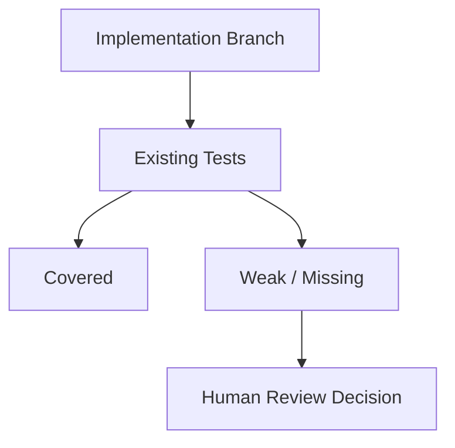

# <Feature> Test Review

> [!abstract] AI Verdict
> **Overall verdict:** `<PASS WITH GAPS | NEEDS HUMAN REVIEW | HIGH CONFIDENCE>`
> **Primary concern:** <一句话概括最大风险>
> **Human review load:** `<N>` items should be reviewed first.
> **Confidence:** `<High | Medium | Low>`

> [!danger] Human First
> 只在这里放 ==真正需要人工先看== 的问题。
>
> 1. `[P1/P2]` <问题标题>
>    为什么需要人看：<一句话>
> 2. `[P1/P2]` <问题标题>
>    为什么需要人看：<一句话>

> [!warning] AI Flagged Gaps
> - <缺失分支 / 断言偏弱 / 分层不准>
> - <缺失分支 / 断言偏弱 / 分层不准>

> [!tip] Covered Well
> - <AI 认为覆盖扎实的点>
> - <AI 认为覆盖扎实的点>

## Scope

- Feature: <Feature>
- Scope boundary: <本次纳入 / 排除什么>
- Focus: <关注维度，例如覆盖、分层、断言强度、稳定性>
- Source modules:
  - [<module-a>](</abs/path/module-a>)
  - [<module-b>](</abs/path/module-b>)
- Test files:
  - [<unit-test-a>](</abs/path/unit-test-a>)
  - [<unit-test-b>](</abs/path/unit-test-b>)
- Strong related non-unit tests:
  - [<integration-test-a>](</abs/path/integration-test-a>)

## Human Review Checklist

- [ ] 确认 ==最高优先级 findings== 是否成立
- [ ] 确认 AI 标记的 ==薄弱覆盖点== 是否真的需要补测
- [ ] 确认 test 分层是否符合仓库约定
- [ ] 确认关键断言是否证明了业务行为，而不只是实现细节
- [ ] 决定哪些低优先级建议暂不处理

## Coverage Heatmap

| Area | Layer | Coverage | Confidence | Human action |
|---|---|---|---|---|
| <功能分组> | `unit` | `Strong / Adequate / Weak / Missing` | `High / Medium / Low` | <需要人工确认什么> |
| <功能分组> | `integration` | `Strong / Adequate / Weak / Missing` | `High / Medium / Low` | <需要人工确认什么> |

## Findings

### [P1/P2/P3] <Finding Title>

> [!danger] Why It Matters
> <这件事为什么值得人工 review。不要只写“建议补测”，要写风险。>

**Evidence**

- Tests: [<test-file>](</abs/path/test-file:line>)
- Impl: [<impl-file>](</abs/path/impl-file:line>)
- Signals:
  - <断言缺失 / 分支未测 / 测试层级不准 / 结果可通过但不证明行为>

**AI Assessment**

- 结论：<一句话>
- 性质：`Missing coverage | Weak assertion | Layering mismatch | Flaky risk | Maintainability`
- 依据：<显式断言 / 代码推断 / 两者都有>

**Human Decision Needed**

- [ ] 接受 AI 结论
- [ ] 判断是否必须补测
- [ ] 判断这是测试问题还是实现设计问题

### [P1/P2/P3] <Finding Title>

> [!warning] Why It Matters
> <说明>

**Evidence**

- Tests: [<test-file>](</abs/path/test-file:line>)
- Impl: [<impl-file>](</abs/path/impl-file:line>)

**AI Assessment**

- 结论：<一句话>
- 性质：<类别>
- 依据：<显式断言 / 推断>

**Human Decision Needed**

- [ ] <动作>

## Logic Map

在复杂逻辑场景下，至少提供一个 Mermaid 图。

如果额外生成了 JSON Canvas，在这里放链接：

- Canvas: [[<feature-slug>.test-review.<YYYY-MM-DD>.canvas|Open Canvas View]]

## Suggested Follow-ups

- [ ] 补 `identity_parseable=false` 一类缺失分支
- [ ] 收紧 unit / integration 分层
- [ ] 为 CLI 文本模式补充可读输出断言

## Test Inventory

> [!note]- Summary
> - Total unit test files: <N>
> - Total extracted unit test cases: <N>
> - Strong related non-unit test files: <N>
> - Strong related non-unit test cases: <N>

## Feature Tree

- <主功能>
- <主功能 / 子功能>
- <主功能 / 子功能 / 错误处理>

## Appendix: Detailed Test Cases

> [!example]- Test Case Tables
> 详细 case 放在折叠区，避免影响主阅读路径。

### <主功能 A>

| Case ID | 功能分组 | 测试名称 | 描述/目的 | 期望输入 | 期望输出 | 具体例子 | 来源 |
|---|---|---|---|---|---|---|---|
| A-01 | <主功能 A / 正常路径> | `<it(...)>` | <验证什么> | <输入/前置条件> | <输出/行为> | <业务可读例子> | [<test-file>](</abs/path/test-file>) |

### <主功能 B / 错误处理>

| Case ID | 功能分组 | 测试名称 | 描述/目的 | 期望输入 | 期望输出 | 具体例子 | 来源 |
|---|---|---|---|---|---|---|---|
| B-E01 | <主功能 B / 错误处理> | `<it(...)>` | <验证什么> | <输入/前置条件> | <输出/行为> | <业务可读例子> | [<test-file>](</abs/path/test-file>) |

## Notes

> [!info] Reading Guide
> - 先看 `AI Verdict`、`Human First`、`Coverage Heatmap`
> - 再看 `Findings`
> - 最后只在需要追证据时展开 `Appendix`
